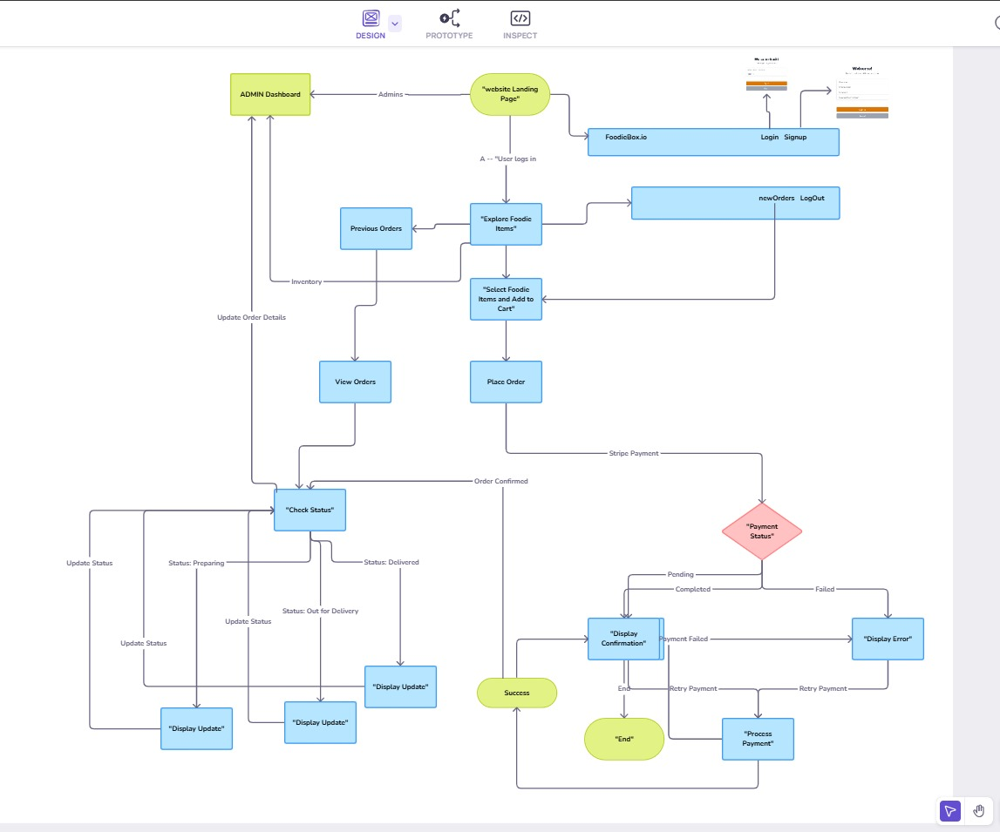

# FoodieBox

**FoodieBox** is a comprehensive restaurant order management system designed to simplify the process of managing orders, tracking them in real-time, and ensuring secure payment processing. This web application is built using Python Django as the backend framework, with Tailwind CSS, and HTML for the frontend, and MySQL as the database.

## Table of Contents

- [Introduction](#introduction)
- [Features](#features)
- [Project Structure](#project-structure)
- [Tech Stack](#tech-stack)
- [Setup](#setup)
- [Design](#design)
- [Screenshots](#screenshots)

## Introduction

FoodieBox streamlines restaurant operations by providing an intuitive interface for both staff and customers. The system allows customers to place orders, track them in real-time, and make secure payments. Restaurant staff can manage orders efficiently, ensuring a smooth workflow from order placement to delivery.

## Features

- **Real-Time Order Tracking:**(Coming soon in future version) Customers can track the status of their orders with a progress bar showing stages like "Order Received," "Being Prepared," "Out for Delivery," and "Delivered."
- **Secure Payment Processing:** Customers can securely enter their payment details, and the system ensures a smooth payment process with immediate feedback on success or failure.
- **Order History:** Users can view their past orders and easily reorder items.
- **Responsive Design:** The interface is optimized for both desktop and mobile devices, ensuring a seamless user experience across all platforms.

## Project Structure

```plaintext
lunchbox_restaurant/
│
├── __pycache__/
├── asgi.py
├── settings.py
├── urls.py
├── wsgi.py
│
├── media/
│   └── dishes/
│
├── orders/
│   ├── __pycache__/
│   ├── migrations/
│   ├── templates/
│   │   └── orders/
│   │       ├── base.html
│   │       ├── home.html
│   │       ├── login.html
│   │       ├── order.html
│   │       ├── payment_cancel.html
│   │       ├── payment_success.html
│   │       └── previous_order.html
│   ├── __init__.py
│   ├── admin.py
│   ├── apps.py
│   ├── forms.py
│   ├── models.py
│   ├── tests.py
│   ├── urls.py
│   └── views.py
│
├── registration/
│   ├── logged_out.html
│   ├── register.html
│   ├── __init__.py
│   ├── forms.py
│   ├── urls.py
│   └── views.py
│
├── manage.py
├── .gitignore
├── README.md
└── requirements.txt

```
## Tech Stack

- **Backend:** Python Django
- **Frontend:** Tailwind CSS, HTML
- **Database:** MySQL
- **Version Control:** Git


## Setup

Follow these steps to set up and run the project on your local machine:

### git clone 

### Create a Virtual Environment:

```bash
python -m venv .venv
```
### On Windows 
```bash
.venv\Scripts\activate
```
### On Linux/MacOS
```bash
source .venv/bin/activate
```

### Install Dependencies:
```bash
pip install -r requirements.txt
```
### Apply Migrations:
```bash
cd lunchbox_restaurant
python manage.py makemigrations
python manage.py migrate
```
### Create a Superuser:
```bash
python manage.py createsuperuser
```
### Run the Server:
```bash
python manage.py runserver
```

### Access the Application:
Open your browser and go to http://127.0.0.1:8000/.

## Design Flow

 

[Visit Wireframe](https://app.visily.ai/projects/4b43ead9-3b5f-43f3-b407-ca6efb5b776a/boards/1048982)


